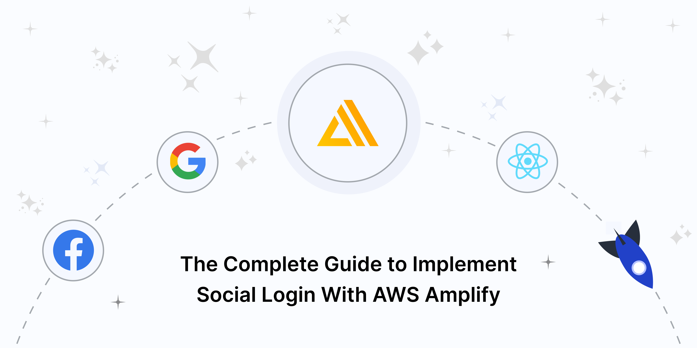
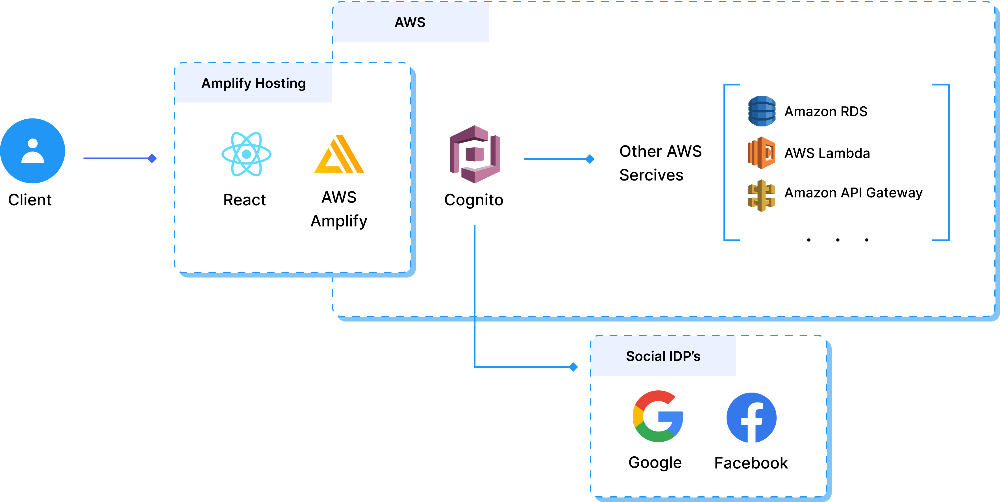

# Social Login With AWS Amplify Workshop

This project is about how to set up a full-stack serverless ReactJS application using AWS Amplify with Google and Facebook Login functionality.

Full details can be found in Blog Posts Referance.

## Blog Posts Reference

| Blog Post  
| -----------------
| [The Complete Guide to Implement Social Login With AWS Amplify](https://www.prplbx.com/resources/blog/social-login-with-aws-amplify-guide)

## Serverless Architecture Guide



## Tech Stack

### Front End Development 💻

 

### Back End Development 📚

  

### Serverless & Cloud Development 🚀

   

### CI/CD & Hosting & Tools 📂

   

## Run Locally

Clone the project

```bash
  git clone https://github.com/PBCLOUD/amplify-social-signin-workshop.git
```

Go to the project directory

```bash
  cd amplify-social-signin-workshop
```

Install dependencies

```bash
  npm install
```

Initialize AWS Environment

```bash
  amplify init
```

Follow instructions on blog post

| [The Complete Guide to Implement Social Login With AWS Amplify](https://www.prplbx.com/resources/blog/social-login-with-aws-amplify-guide)

Start the server

```bash
  npm run start
```

## Feedback

If you have any feedback, please reach out to us at canberk@prplbx.com
